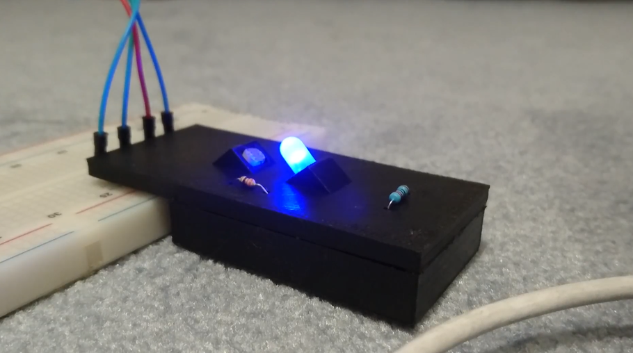
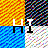
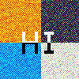
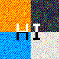

# OptoGlitch


Turning an Arduino, a LED and a Photo Resistor into an physical glitch art filter!

## Showcase


## Prelude

It is absolutely no secret that I have an unhealthy obsession with the aesthetics manifested by analogous errors. Despite the fact that the VHS Cassette was already being replaced by its digital competitor, the DVD, by the time I was born, I was still fortunate enough to become one of the last witnesses of the legendary video format. The time stamps, the "play" button, the washed out colors and static noise will always invoke a warm feeling of nostalgia for me. And it is due to this induced nostalgia, that my desire in glitch art strives after the analogous error.

Since the introduction of digital media formats, we have become spoiled in media quality. As an result, we now treat analogous error as an visual aesthetic, and ironically often attempt to digital recreate it. I myself must obviously admit, that I proudly contribute to the digital recreation of analogous error, in form of glitch art. While I have yet to get my hands on a proper VHS recorder or camcorder, I have attempted to improvise by finding alternate ways of analogous data transfer that do not require access to the rather complex electronics found in a VHS recorder. And that is exactly what has lead to this project. While the results certainly vary from VHS glitches, I must admit that I am still very satisfied by the errors caused through analogous noise.

## Overview

OptoGlitch is an Arduino project that attempts to artificially induce analogous errors by passing image data through an analogous optocoupler circuit.


### Hardware
The optocoupler consists nothing more than a photo resistor, a LED (blue in our case) and two resistors, where one drives the LED (220 Ohm) and the other one acts as a voltage reference for the photo resistor input (330 Ohm).

The schematic looks as it follows:


Since the choice of analog pins is interchangeable, the schematic generalizes them. In the case of this project, the currently utilized pins can be found in the [pin header](src/Pins.h).

Since I was so satisfied with the results delivered by this project, I have also decided to 3D print an enclosure for the circuitry. The wiring estimates the following sketch:


In its enclosure, the device turned out to look and function quite neatly:



Notice that the photo resistor and LED are raised at a 45 degree angle. This grants easier access for manual interference and allows the photo resistor to capture environmental noise.

The STL files for the 3D printed enclosure can be found here:

- [top](stl/Top.stl)
- [bottom](stl/Bottom.stl)

### Software

The transmission of data is achieved by setting the LED to the brightness of the pixel value (ex. (255, 0, 120) would set the LED to 255 brightness, 0 brightness and 120 brightness). The photo resistor captures the brightness of the LED, and the software attempts match the photo resistor input to its original pixel value through various calibration methods. Since the process is analogous, it is very prone to noise caused by external light sources. Additionally, the Arduino can only distinguish between a finite set of voltage levels. These, and many more factors result in erroneous readings, which are then responsible for the glitch aesthetics.

#### Calibration
Since the photo resistor readings don't exactly match the LED brightness, the software attempts to calibrate the photo resistor input through the computation of a standard deviation. The Arduino software provides a total of two calibration modes, each compensating for the value deviation in a different way.

##### Standard Deviation

Before any image is parsed, the Arduino performs a calibration process, in which is a mean photo resistor inputs is compared to all 256 LED brightness levels (0 - 255). From the received set of mean readings (256 values in total), the Arduino then computes the standard deviation between the mean readings and the LED brightness that they should match.

Once the image parsing process begins, all photo resistor values are subtracted by- or added to the standard deviation, depending whether the photo resistor value is smaller or greater than the LED brightness.

To set the calibration mode to standard deviation, pass the following serial command while the device is idling:

```
set cmode stddev
```

##### Lookup Table

Just as with the standard deviation The lookup table calibibration takes place before an image is parsed. The lookup table calibration loads a total of 256 mean photo resistor readings, one for each LED brightness, into an array.

Once the image parsing process begins, the photo resistor value is mapped to its nearest matching array entry entry. The array index is then selected as the value that matches the photo resistor input.

**The lookup table calibration is the default calibration mode** and is vastly superior to the standard deviation when it comes to color accuracy. Its slight drawback comes from the prolonged parsing time.

To set the calibration mode to lookup table, pass the following serial command while the device is idling:

```
set cmode lookup
```

##### No calibration

If one desires to utilize photo resistor readings in their pure form, calibration can be disabled with the following serial command:

```
set cmode none
```

##### Other properties

The intensity of error can be further reduced through the implementation of a mean reading. A mean reading is determined by calculating the average of a set of photo resistor inputs for a specific brightness, rather than just relying on a single sample. The amount of samples to calculate the mean can be specified through the serial console via the `set samples` command. For instance, `set samples 0` will skip the calculation of a mean and simply rely on a single reading. Contrary, `set samples 100` will tell the Arduino to collect a total of 100 samples per brightness and then calculate the mean. By default, the `samples` property is set to 0.

Original:


---

`set samples 0` on standard deviation:


Parse time: 00:30 Seconds

---

`set samples 50` on standard deviation:


Parse time: 03:26 min

---

`set samples 100` on standard deviation:


Parse time: 06:03 min

With sample rate, color accuracy and parse time rises.

Further, we tend to reach the end of an threshold, as change in the mean reduces with more values provided.

Another property that can greatly reduce error is the `transition` property. Just like the mean sample rate, the transition property can be set through the serial console via the `set transition` command. The transition property defines the given time in ms for the LED to change its brightness. Giving the LED more time to change its brightness reduces the risk of developing artifacts from the previous pixel value. By default the transition time is set to 0, as such an error often provides desired aesthetics.

Original:


---

`set transition 0` on standard deviation:


Parse time: 00:30 Seconds

---

`set transition 1`  on standard deviation:



Parse time: 01:00 min

---

`set transition 5` on standard deviation:



Parse time: 03:00 min

---

`set transition 10` on standard deviation:



Parse time: 05:31 min

Once again, the accuracy and time rises. Obviously an LED only a fixed ammount of time to fully change its brightness. As a result, it is isn't recommended to set this property to values above 10ms, as no notable improvements should be visible.

Utilizing both properties will clearly yield the best results, if those are desired:

Original:


---

`set samples 100` and `set transition 5` on standard deviation:


Parse time: 08:34 min

## Documentation

A hardware and software documentation is planned

## License

This project is licensed by the GPLv3

```
Copyright (C) 2018 Patrick Pedersen <ctx.xda@gmail.com>

This program is free software: you can redistribute it and/or modify
it under the terms of the GNU General Public License as published by
the Free Software Foundation, either version 3 of the License, or
(at your option) any later version.

This program is distributed in the hope that it will be useful,
but WITHOUT ANY WARRANTY; without even the implied warranty of
MERCHANTABILITY or FITNESS FOR A PARTICULAR PURPOSE.  See the
GNU General Public License for more details.

You should have received a copy of the GNU General Public License
along with this program.  If not, see <https://www.gnu.org/licenses/>.
```
